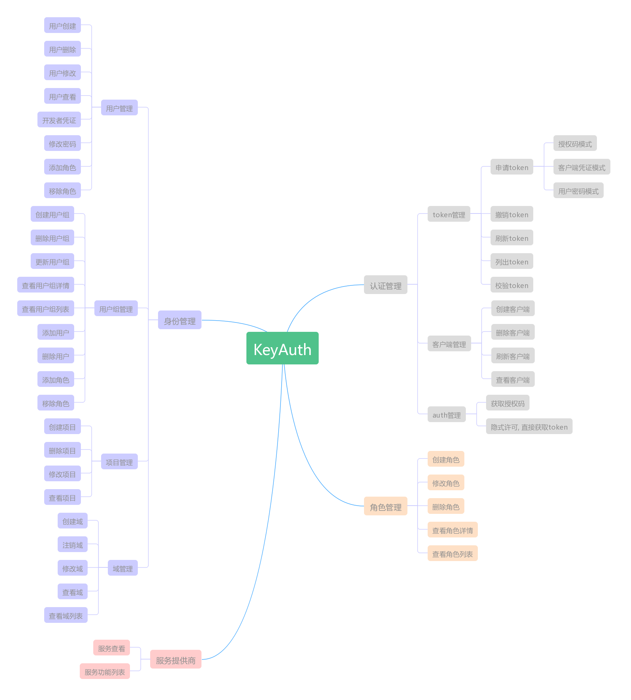
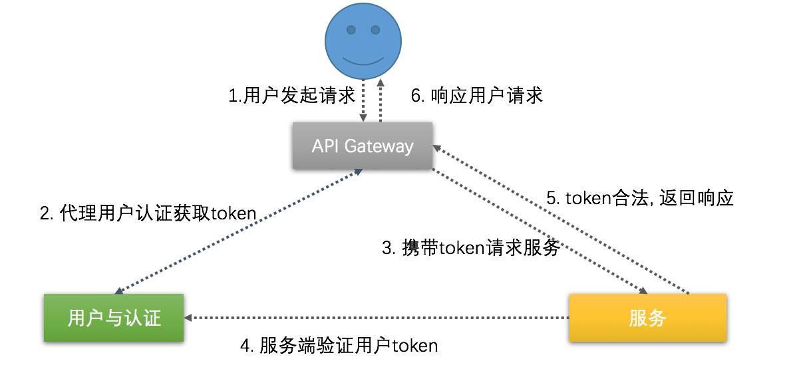
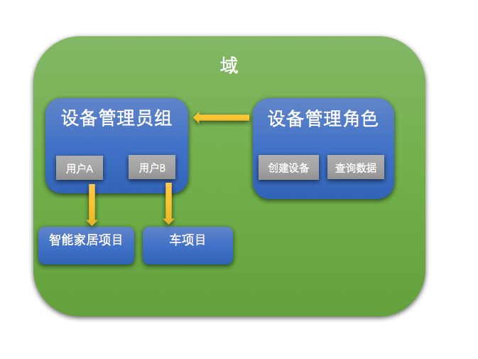
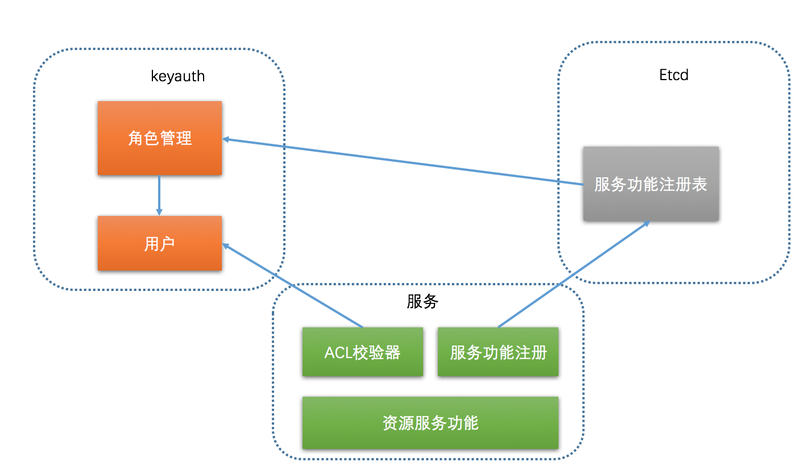

# Keyauth Design Summary
介绍关于keyauth的开发场景, 设计目标,设计方式

## 场景和需求
对于一个多租户系统, 必须支持以公司或者组织为单位的用户管理, 以角色为单位的授权管理, 以资源为单位的项目管理。我们以公司A为例做场景说明:
+ 公司或者组织注册一个账号(域管理员账号), 比如admin/admin
+ 域管理员创建了2个项目: ProjectA 和 ProjectB
+ 域管理员创建了10个用户 user1~user5属于ProjectA, user6~user10属于ProjectB, 同时为user添加角色
+ 然后这些人登录系统, 设备管理员负责设备的接入, 数据管理员负责数据的授权与分发, 算法管理员服务算法的上传和执行
+ 如果公司需要基于ProjectA开发自己的APP, 则需要域管理员创建一个APP开发者凭证

针对第三方开发者的支持:
+ 添加第三方开发者用户, 通过添加一个用户, 并赋予该用户相应的角色, 来访问这些数据。
+ 不添加用户, 利用oauth2, 让用户从定向到keyauth完成用户数据的授权, 然后第三方开发者获取到相应的数据。

## 为什么要开发keyauth?
openstack的keystone基本满足上面的需求,但是存在这些问题:
+ 服务目录我们并不需求, 我们服务发现交给网关做了
+ oauth2的认证模式支撑不是很好
+ 性能问题, 并发3000都撑不住
+ ACL必须在服务端配置, 不能在keystone出进行配置

基于以上原因, 我们准备开发一套适合自己的用户认证服务

## 具体设计
在参考了[openstack keystone](https://developer.openstack.org/api-ref/identity/v3/?expanded=password-authentication-with-unscoped-authorization-detail,password-authentication-with-scoped-authorization-detail) 和 [cloud foundry uaa](http://docs.cloudfoundry.org/api/uaa/#user-token-grant-21336)后, 我们觉得keyauth的功能列表应该是这样的: 

下面对一些核心概念做出一一解释:
+ 域: 用户, 用户组, 项目的一个集合, 域全局唯一, 每个用户, 用户组, 项目必须属于一个确定的域
+ 用户: 系统的使用者, 域内唯一, 通过用户角色来控制用户访问系统资源的能力,  用户访问系统资源时必须携带其项目名称, 如果未携带 则使用默认项目名称
+ 用户组: 用户的集合, 域内唯一, 通过对用户组进角色的分配可以实现用户的统一授权, 通常在用户比较多时使用, 方便授权的管理
+ 项目: 项目是一组资源的集合, 域内唯一, 任何资源必须属于一个确切的项目, 项目内的用户, 共享项目资源。

+ 服务提供商: 服务功能的集合, 全局唯一, 由一个服务提供商提供服务的功能列表。
+ 角色: 角色用于控制用户对系统功能列表的访问权限, 一个角色包含一组服务的功能列表
+ 令牌(Token): 用户访问服务的凭证, 通过OAuth2的几种方式获得

### 认证逻辑
用户认证访问服务的逻辑
+ 用户通过用户信息(用户名, 域, 项目)以及认证手段(比如密码认证)来获取一个访问服务的token
+ 用户携带该Token访问真正的资源服务
+ 资源服务获取到用户token后, 去keyauth获取该token的相关信息, 然后根据这些用户信息返回用户访问的资源。

### 身份逻辑
用户的身份信息包含: 用户, 用户组, 角色, 项目, 域 这5部分组成, 他们的关系如图:

+ 用户组是用户的容器, 用户的角色控制着用户可以访问那些服务, 用户的项目和域控制着用户操作资源的归属地。
+ 角色由很多服务的功能组成, 控制这服务功能的访问控制, 角色可以赋予用户组或者直接赋予用户, 拥有该角色的用户, 就拥有相应服务功能的访问权限, 角色仅能由系统管理员创建, 域管理员仅能分配角色。

### ACL逻辑
服务将自己的功能列表注册到 注册中心, 系统管理员根据需要创建角色, 并且将这些角色和服务功能进行关联, 服务验证token,获取用户的角色对应的功能列表, 进行校验, 从而实现 用户访问服务功能的ACL, 逻辑流程如下:

+ 服务将自己的功能列表注册到etcd的服务功能列表注册中心
+ 系统管理员选择合适的功能列表进行分配, 创建响应的角色
+ 服务通过token验证, 获取用户角色的功能访问列表, 并检查是否有权力调用该功能。
+ 如果通过这调用功能进行用户响应。

当然系统会初始化一些默认角色:
系统管理员: 整套用户系统的超级管理员, root一般的存在, 拥有所有功能的使用权限, 并且负责角色的创建。
域管理员: 除了角色管理以及域管理(仅能查看域详情)以外的一切权限。
普通用户: 仅仅拥有该项目资源的查看权限。